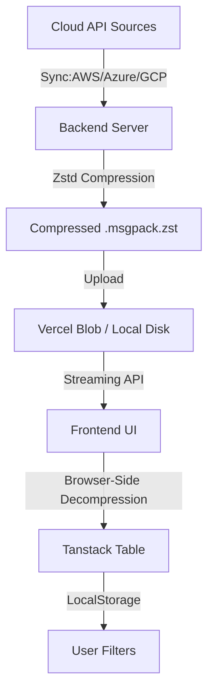

# 🗄️ WhichVM: The Ultimate Cloud Compare

[](https://nextjs.org/)
[](https://www.typescriptlang.org/)
[](https://github.com/facebook/zstd)
[](https://expressjs.com/)

**WhichVM** is an elite, high-performance comparison engine for Cloud Virtual Machines. It aggregates, compresses, and streams exhaustive instance specs and pricing across **AWS**, **Azure**, and **GCP** into a lightning-fast, interactive dashboard.

---

### 🔥 Key Features

| Feature | Description |
| :--- | :--- |
| **⚡ Instant Search** | Real-time filtering across thousands of VM types from AWS, Azure, and Google Cloud. |
| **📦 Zstd Compression** | Implements `MsgPack` + `Zstandard (zstd)` for **10x data payload shrinkage**, ensuring instant initial load. |
| **🔄 Live Synchronization** | Automated backend pipeline fetching fresh pricing directly from upstream Cloud APIs. |
| **🗂️ Zero-DB Dashboard** | Purely file-based architecture using compressed streaming; no database required for the main UI. |
| **📱 Responsive UI** | Built with Next.js App Router and Shadcn UI, optimized for both desktop and mobile layouts. |
| **📉 Multi-Plan Pricing** | Support for **Reserved**, **Spot**, **Savings Plans**, and **Hybrid Benefit** across all providers. |

---

### 🛡️ Technology Stack

- **Frontend**: [Next.js](https://nextjs.org/) (App Router), [Shadcn UI](https://ui.shadcn.com/), [Tanstack Table](https://tanstack.com/table/v8), [Framer Motion](https://framer.com/motion)
- **Backend**: [Express](https://expressjs.com/) with [TypeScript](https://www.typescriptlang.org/), `fzstd` for ultra-fast compression.
- **Compression**: `MsgPack` + `Zstandard (zstd)` for binary-level data optimization.
- **Storage**: [Vercel Blob Storage](https://vercel.com/storage/blob) for serving global compressed datasets.

---

### 🏗️ Data Architecture



---

### ⚙️ Local Development

#### 1. Backend Configuration
```bash
cd backend
npm install
```

Create a `.env` file in `backend/`:
```env
PORT=5000
# Individual keys for each provider
CLOUDPRICE_AWS=your_key
CLOUDPRICE_AZURE=your_key
CLOUDPRICE_GCP=your_key
# For production
# BLOB_READ_WRITE_TOKEN=your_token
# CRON_SECRET=your_secret
```

**Run Backend:** `npm run dev`
**Run Initial Sync:** `npm run cron` (Fetches and compresses cloud data into `output/`)

#### 2. Frontend Configuration
```bash
cd frontend
npm install
npm run dev
```

Create a `.env` file in `frontend/`:
```env
NEXT_PUBLIC_BLOB_CDN_URL=your_blob_cdn_url
```
---

---
*Built for developers who care about cloud cost and performance by [Jayanth](https://github.com/Jayanth1312).*
