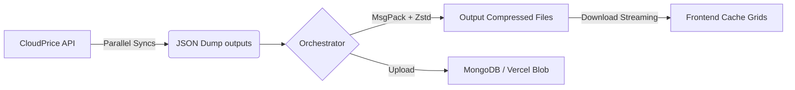

# whichvm.com

**WhichVM** is a high-performance comparison tool for Cloud Virtual Machines. It aggregates, compresses, and streams instance specifications and pricing across **AWS**, **Azure**, and **GCP** into an interactive, lightning-fast frontend dashboard.

---

## 🚀 Key Features

- **Side-by-Step Comparisons**: View and contrast VM families across vendors on compute, storage, RAM, and GPUs.
- **Extreme Compression Pipeline**: Uses `MsgPack` and `Zstandard (zstd)` for ~10x data payload shrinkage to facilitate instant downloads of large lookup datasets.
- **Client-Side Virtualization**: Uses `@tanstack/react-virtual` with dynamic infinite grid scrolling supporting thousands of row updates seamlessly.
- **Provider Parity**: Seamless parsing support across standard layouts into a layout system (AWS EC2, Azure VMs, GCP Compute Engine).

---

## 🛠️ Technology Stack

| Layer | Technologies |
| :--- | :--- |
| **Frontend** | [Next.js](https://nextjs.org/) (App Router), [Shadcn UI](https://ui.shadcn.com/), [Tanstack Table](https://tanstack.com/table/v8), [Framer Motion](https://framer.com/motion) |
| **Backend** | [Express](https://expressjs.com/) & [TypeScript](https://www.typescriptlang.org/), [MongoDB Node Driver](https://mongodb.github.io/node-mongodb-native/), `fzstd`, `@msgpack/msgpack` |
| **Data Source** | [CloudPrice v2 API](https://data.cloudprice.net/) |

---

## 📂 Project Structure

```text
├── backend/                  # Express API & Data Sync
│   ├── src/
│   │   ├── apis/             # REST endpoints (Cron, Data, Instances)
│   │   ├── pipeline/         # Data Pipeline (Compressor, Orchestrator, Mongo Sync)
│   │   ├── sync-*.js         # CloudPrice API provider listing fetchers
│   │   └── server.ts         # Server entry point
│   └── output/               # Static/Compressed build assets storage
└── frontend/                 # Next.js Dashboard
    ├── app/                  # App Router & views ([provider], compare)
    └── components/           # Reusable data grids & layouts
```

---

## ⚙️ Prerequisites

- **Node.js**: `v22+`
- **MongoDB**: Active connection string for synchronization targets

---

## 🛠️ Getting Started

### 1. Backend Setup

```bash
cd backend
npm install
```

Create a `.env` file in the `backend/` directory from `.env.example`:

```bash
PORT=5000
MONGO_URI=your_mongodb_connection_uri
DB_NAME=whichvm
CLOUDPRICE_KEY=your_cloudprice_api_key
```

**Run Development Server:**
```bash
npm run dev
# Server binds to http://localhost:5000 (or as configured)
```

#### 🔄 Data Pipeline Running

To fetch initial pricing files (placed in `backend/output/` and MongoDB sync points), trigger the sequentially-managed updater list:

```bash
# Run AWS, Azure, GCP APIs sequentially and aggregate output nodes
npm run cron
```

---

### 2. Frontend Setup

```bash
cd frontend
npm install
```

Optionally, create a `.env` file in the `frontend/` directory to configure the Blob CDN URL. This allows the frontend to fetch data files directly from the CDN instead of proxying through the backend:

```bash
NEXT_PUBLIC_BLOB_CDN_URL=https://your-project-id.public.blob.vercel-storage.com
```

**Run Development Server:**
```bash
npm run dev
# App listens on http://localhost:3000
```

---

## 🧩 Data Ingestion Flow



To sync your data locally while starting development, always execute `npm run cron` inside the `backend/` scope inside your routine maintenance updates.
